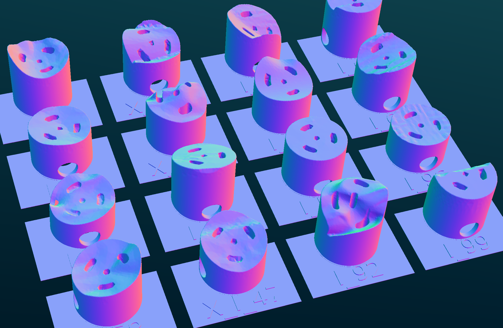
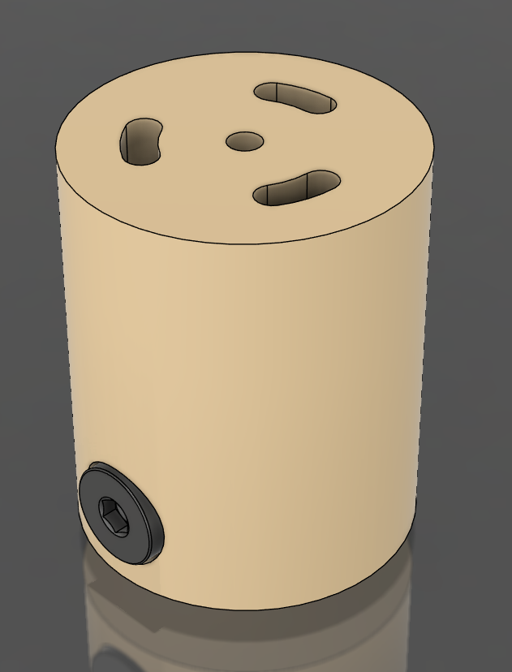
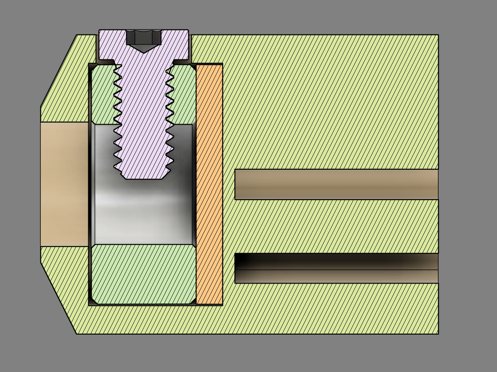
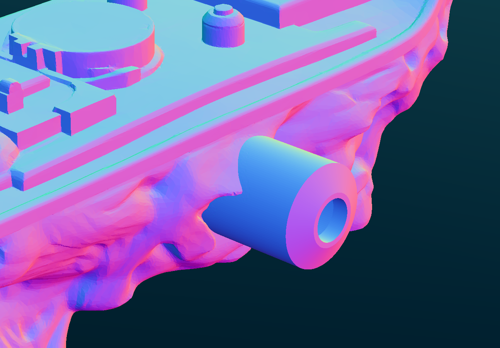
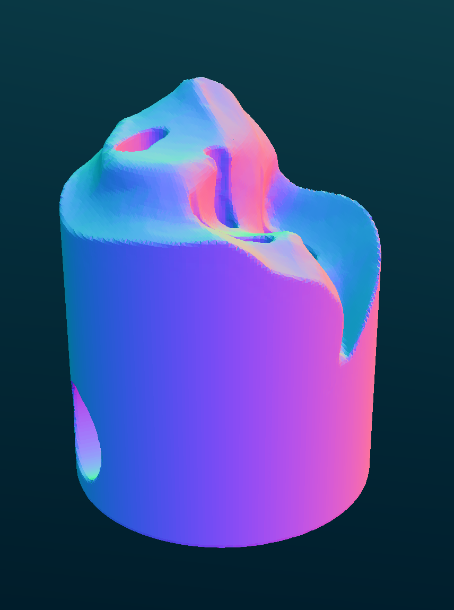

# Olalekan Jeyifous Fluvial Taxonomies Wall Mounts

<p align="center">
  
  
</p>

A programmatic approach to generating 40 unique wall mounts for Olekelan Jeyifous' sculpture series: *Fluvial Taxonomies* as part of [*Hydrocosmic Litanies*](https://www.walkerart.org/whats-on/olalekan-jeyifous-hydricosmic-litanies/), his solo exhibition at the Walker Art Center.

This repository contains the editable mount files with their exported meshes, final print-ready STLs, and the batch-processing workflow used to center, identify, thermally compensate, and repair each mount before printing.

*__This repository does not contain any artwork meshes or original artist files__*

## Files
Fabrication files and processing tools for the wall-mount system.
> 📂 **[3d-files](3d-files)/** — *source mount geometry*<br>
> - 📁 [`isolated-mount-meshmixer`](3d-files/isolated-mount-meshmixer)/ — *editable Meshmixer project files*
> - 📁 [`isolated-mount-export`](3d-files/isolated-mount-export)/ — *exported STL files used as processing inputs*
>
> 📂 **[ready-for-print](ready-for-print)/** — *processed and repaired print files*<br>
> - 📁 [`printed`](ready-for-print/printed)/ — *completed mounts retained for print tracking*
> - 🧊 [`insert.stl`](ready-for-print/insert.stl) — *generated insert puck*
>
> 📂 **[scripts](scripts)/** — *Python and OpenSCAD processing tools*<br>
> - 🐍 [`batch_process_ft_mounts.py`](scripts/batch_process_ft_mounts.py) — *main batch-processing script*
> - ⚙️ [`batch_openscad.scad`](scripts/batch_openscad.scad) — *combined label and thermal-compensation operation*
> - ⚙️ [`generate_label.scad`](scripts/generate_label.scad) — *standalone label generator used by the fallback process*
> - ⚙️ [`label_module.scad`](scripts/label_module.scad) — *label and brim geometry*
> - ⚙️ [`thermal_expansion_ring.scad`](scripts/thermal_expansion_ring.scad) — *thermal-expansion compensation cutting geometry*
> - ⚙️ [`insert.scad`](scripts/insert.scad) — *insert puck geometry*

## Background and File Preproduction

Installing *Fluvial Taxonomies* presented several technical challenges. The resin-printed sculptures are fragile, with highly detailed surfaces and no preordained mounting points nor provisions for hardware. The piece is intended to be shown as groupings of objects mounted offset from the walls in the gallery. I determined that the best way to hang them was a custom 3d-printed mount per-object, secured to the sculpture with specialty plastic epoxy. These mounts are created from duplicates of a standard base geometry, pictured below, that each have a sculpture digitally subtracted from them:

<p align="center">
  
  
</p>

The inserted shaft collar *([McMaster: 9946K15](https://www.mcmaster.com/9946K15/))* allows for a strong coupling to wall-mounted rods, with the low-profile machine screw *([McMaster: 92220A182](https://www.mcmaster.com/92220A182/))* arresting rotation inside the mount and the axial channels allow epoxy to seep into the structure for a mechanically-rigid bond.

<p align="center">
  
  
  
</p>

The next step was to scale the sculpture models, virtually place the mounts, and perform the Boolean operations. The artist-provided sculpture mesh files were not consistently scaled, so an extent measurement was taken from the physical piece and used to correctively transform the file. Then, a copy of the mount geometry was manually oriented against it, with as much of the region beyond the start of the epoxy channels intersecting the sculpture geometry as possible. The sculpture was subtracted from the mount, and the mount was re-oriented axially along the z-axis (without regard to its position in world space), before being made watertight and exported as a stereolithography file.

Meshmixer was chosen to perform these operations as it was the most lightweight tool that could consistently load the meshes and successfully perform the Boolean. Other programs either lacked the ability to both manipulate and view the mesh efficiently, or failed to perform the subtraction due to the number of mesh degeneracies in the sculpture files.

## Script Behavior

For each STL in `3d-files/isolated-mount-export`, the batch-processing script:

1. Centers the mesh on the x/y origin and places its base on the z=0 plane.
2. Generates an identification label from the source filename and joins it to the mount.
3. Subtracts a compensation tool around the insert region to reduce bulging at the transition between printed density regions.
4. Exports the completed model to `ready-for-print` using the suffix `_for-print.stl`.
5. Repairs the completed STL with ADMesh.

The script first attempts to perform the label union and compensation cut as a single OpenSCAD operation. If OpenSCAD cannot process the imported mesh, it falls back to separate `stl_cmd` boolean operations for non-manifold geometry.

A matching file placed in `ready-for-print/printed` is treated as complete and will be skipped during later runs.

## Requirements

- Python 3
- OpenSCAD, available as `openscad` in the system PATH
- ADMesh, available as `admesh` in the system PATH
- `stl_cmd` by AllwineDesigns, including `stl_zero` and `stl_boolean` in the system PATH

*Recommended .stl viewer: [fstl](https://github.com/fstl-app/fstl)*

## Usage

Run the batch processor from the repository root:

```bash
python3 scripts/batch_process_ft_mounts.py
```

New source files should be placed in:

```text
3d-files/isolated-mount-export/
```

Completed files will be written to:

```text
ready-for-print/
```

The source filename is carried through the workflow and used for both the identification label and final output filename. Move a verified print into `ready-for-print/printed` to prevent it from being regenerated during subsequent batch runs.
